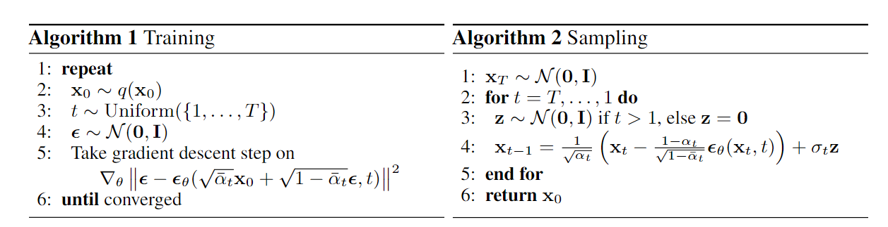

# 项目介绍
基于论文《Denoising Diffusion Probabilistic Models》实现diffusion model案例。  
基于数据集FashionMNIST和MNIST实现图像生成。

# 相关笔记
## 扩散模型
```
扩散模型包含两个过程，前向扩散过程和反向生成过程。
前向扩散过程对一张图像逐渐添加高斯噪声，直至图像变为随机噪声。
反向生成过程从一个随机噪声开始，逐渐去噪声直至生成一张图像。
```

## 训练过程
通过以下公式对图像进行加噪:
$$x_{t}=\sqrt{\bar{a}}\*x_{0}+\sqrt{1-\bar{a}}\*\epsilon$$

```python
def forward(self, x0, t, eta = None):
    n, c, h, w = x0.shape # 输入图片的shape
    a_bar = self.alpha_bars[t]
    if eta is None:
        eta = torch.randn(n, c, h, w).to(self.device)
    noisy = a_bar.sqrt().reshape(n, 1, 1, 1) * x0 + (1 - a_bar).sqrt().reshape(n, 1, 1, 1) * eta # 加噪
    return noisy # 返回加噪结果
```

## 损失函数
通过一个UNet网络来预测损失，计算预测损失和真实损失MSE损失
```python
...
eta = torch.randn_like(x0).to(device) # 产生真实随机噪声
t = torch.randint(0, n_steps, (n,)).to(device)

# 前向扩散过程
noisy_imgs = ddpm(x0, t, eta)

# 通过UNet预测噪声
eta_theta = ddpm.backward(noisy_imgs, t.reshape(n, -1))

# 计算预测噪声和真实随机噪声的MSE损失
loss = mse(eta_theta, eta)
...
```

## 生成过程
通过以下公式实现图片生成:
$$x_{t-1}=\frac{1}{\sqrt{a}}\*(x_{t}-\frac{1-a_{t}}{\sqrt{1-\bar{a_{t}}}}\*\epsilon_{0})+\sigma z$$

```python
x = torch.randn(n_samples, c, h, w).to(device) # 随机初始化噪声
for idx, t in enumerate(list(range(ddpm.n_steps))[::-1]):
    time_tensor = (torch.ones(n_samples, 1) * t).to(device).long()
    eta_theta = ddpm.backward(x, time_tensor)
    alpha_t = ddpm.alphas[t]
    alpha_t_bar = ddpm.alpha_bars[t]

    x = (1 / alpha_t.sqrt()) * (x - (1 - alpha_t) / (1 - alpha_t_bar).sqrt() * eta_theta) # 去噪
    if t > 0:
        z = torch.randn(n_samples, c, h, w).to(device)
        beta_t = ddpm.betas[t]
        sigma_t = beta_t.sqrt()
        x = x + sigma_t * z
```

<div align=center>


</div>

