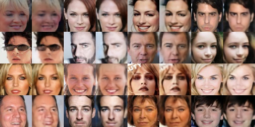
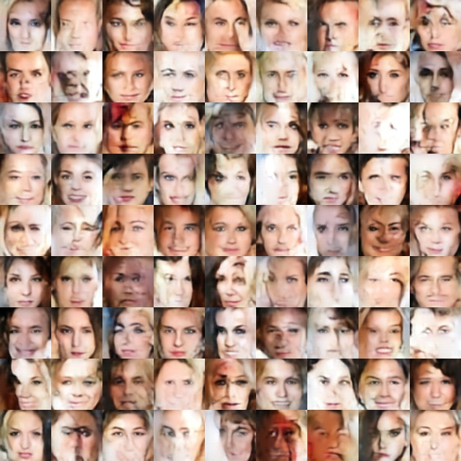

# 下载数据
从[Kaggle](https://www.kaggle.com/datasets/badasstechie/celebahq-resized-256x256)中下载训练数据集（约297MB），并放到下面的文件夹中:  
```bash
# 创建文件夹
mkdir ./data/celebA/

# 数据地址
- data/
    - celebA
        - celeba_hq_256
            - 00000.jpg
              ...
              29999.jpg
```
# 训练配置
## 四种不同的训练配置
```python
celebahq_cfg0 = dict(dataset_type='CelebAHQ',
                     img_shape=(3, 128, 128),
                     dim=128,
                     n_embedding=64,
                     batch_size=64,
                     n_epochs=30,
                     l_w_embedding=1,
                     l_w_commitment=0.25,
                     lr=2e-4,
                     n_epochs_2=200,
                     batch_size_2=32,
                     pixelcnn_n_blocks=15,
                     pixelcnn_dim=384,
                     pixelcnn_linear_dim=256,
                     vqvae_path='./ckpt/model_celebahq_1.pth',
                     gen_model_path='./ckpt/gen_model_celebahq_1.pth')

celebahq_cfg1 = dict(dataset_type='CelebAHQ',
                     img_shape=(3, 128, 128),
                     dim=128,
                     n_embedding=128,
                     batch_size=64,
                     n_epochs=30,
                     l_w_embedding=1,
                     l_w_commitment=0.25,
                     lr=2e-4,
                     n_epochs_2=200,
                     batch_size_2=32,
                     pixelcnn_n_blocks=15,
                     pixelcnn_dim=384,
                     pixelcnn_linear_dim=256,
                     vqvae_path='./ckpt/model_celebahq_2.pth',
                     gen_model_path='./ckpt/gen_model_celebahq_2.pth')

celebahq_cfg2 = dict(dataset_type='CelebAHQ',
                     img_shape=(3, 64, 64),
                     dim=128,
                     n_embedding=64,
                     batch_size=64,
                     n_epochs=20,
                     l_w_embedding=1,
                     l_w_commitment=0.25,
                     lr=2e-4,
                     n_epochs_2=200,
                     batch_size_2=32,
                     pixelcnn_n_blocks=15,
                     pixelcnn_dim=384,
                     pixelcnn_linear_dim=256,
                     vqvae_path='./ckpt/model_celebahq_3.pth',
                     gen_model_path='./ckpt/gen_model_celebahq_3.pth')

celebahq_cfg3 = dict(dataset_type='CelebAHQ',
                     img_shape=(3, 64, 64),
                     dim=128,
                     n_embedding=32,
                     batch_size=64,
                     n_epochs=20,
                     l_w_embedding=1,
                     l_w_commitment=0.25,
                     lr=2e-4,
                     n_epochs_2=100,
                     batch_size_2=32,
                     pixelcnn_n_blocks=15,
                     pixelcnn_dim=384,
                     pixelcnn_linear_dim=256,
                     vqvae_path='./ckpt/model_celebahq_4.pth',
                     gen_model_path='./ckpt/gen_model_celebahq_4.pth')
```

# 两阶段训练
## 第一阶段
### 训练VQVAE模型
```bash
# use setting 4, device 0, stage 0 to train：
python main.py --config 3 --device 0 --stage 0
```

### 测试VQVAE模型的重建能力
```bash
# use setting 4, device 0, stage 0 to test：
python main.py --config 3 --device 0 --stage 0 --only_test

# left: source image
# right: reconstructed image
# 20 epoch
```
<div align=center>

</div>

## 第二阶段
### 训练PixelCNN模型
```bash
# use setting 4, device 0, stage 0 to train：
python main.py --config 3 --device 0 --stage 1
```

### 测试基于PixelCNN和VQVAE模型的生成能力
```bash
# use setting 4, device 0, stage 0 to test：
python main.py --config 3 --device 0 --stage 1 --only_test

# The following figure is only the result after 1 epoch training:
```
<div align=center>

</div>


# 代码参考
[VQVAE PyTorch 实现教程](https://zhuanlan.zhihu.com/p/640000410)
