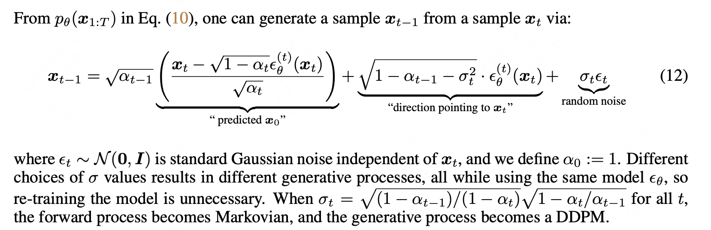
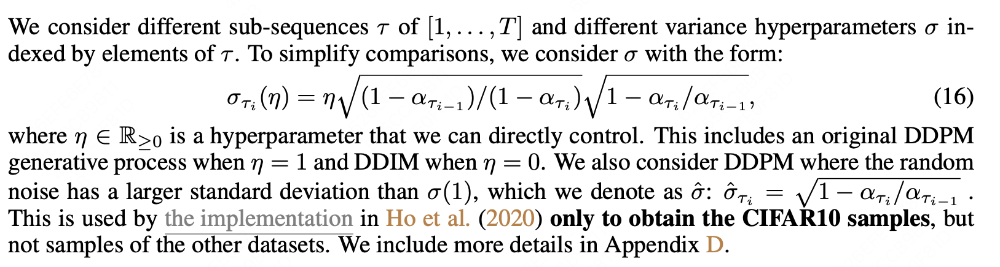

# SD_DDIM
# 前言
SD中DDIM的核心公式遵循论文[DENOISING DIFFUSION IMPLICIT MODELS](https://arxiv.org/pdf/2010.02502)，因此配合论文阅读更佳！

# 核心模块剖析
<div align=center>

</div>

1. 基于$x_t$生成$x_{t-1}$的方法遵循上式，SD中的实现代码如下：

```python
 # current prediction for x_0
pred_x0 = (x - sqrt_one_minus_at * e_t) / a_t.sqrt() # 论文https://arxiv.org/pdf/2010.02502中公式(12)的第一项

# direction pointing to x_t
dir_xt = (1. - a_prev - sigma_t**2).sqrt() * e_t # 论文https://arxiv.org/pdf/2010.02502中公式(12)的第二项 
noise = sigma_t * noise_like(x.shape, device, repeat_noise) * temperature # 论文https://arxiv.org/pdf/2010.02502中公式(12)的第三项 # 由于输入的eta为0，因此sigma_t为0，因此本式的结果为0

if noise_dropout > 0.:
    noise = torch.nn.functional.dropout(noise, p=noise_dropout)
x_prev = a_prev.sqrt() * pred_x0 + dir_xt + noise # 构成论文https://arxiv.org/pdf/2010.02502中的公式(12)，即根据x_t得到x_(t-1)
```

<div align=center>

</div>

2. 生成$\sigma$的方法遵循上式，SD中的实现代码如下：

```python
# according the the formula provided in https://arxiv.org/abs/2010.02502 论文中的公式16
sigmas = eta * np.sqrt((1 - alphas_prev) / (1 - alphas) * (1 - alphas / alphas_prev))
```

3. SD中生成$\alpha_t$和$\alpha_{t-1}$的代码如下：

```python
alphas = alphacums[ddim_timesteps] # 由于alphacums来自DDPM，所以本质上还是调用了DDPM的alphas_cumprod，即[0.9983, 0.9804, ..., 0.0058]
alphas_prev = np.asarray([alphacums[0]] + alphacums[ddim_timesteps[:-1]].tolist()) # 构成alphas_prev的方法是保留前49个alphas，同时在最前面添加DDPM的alphas_cumprod[0], 即[0.9991]
```

代码中的**alphacums**本质上来自于DDPM中的alphas_cumprod，即：
```python
betas = make_beta_schedule(beta_schedule, timesteps, linear_start=linear_start, linear_end=linear_end,
                            cosine_s=cosine_s) # 计算 betas [0.00085, 0.0008547, ..., 0.012] # total 1000
alphas = 1. - betas # 根据betas计算alphas [0.99915, 0.9991453, ..., 0.988] # total 1000
alphas_cumprod = np.cumprod(alphas, axis=0) # 计算alphas_cumprod [0.99915, 0.99915*0.9991453, ..., ..*0.988] # 与本身及前面的数进行相乘
```

4. SD中还采用了Free Guidance的思想，实现代码如下：
```python
        if unconditional_conditioning is None or unconditional_guidance_scale == 1.:
            e_t = self.model.apply_model(x, t, c)
        else:
            x_in = torch.cat([x] * 2) # [3, 4, 64, 64] -> [6, 4, 64, 64]
            t_in = torch.cat([t] * 2) # [3] -> [6]
            c_in = torch.cat([unconditional_conditioning, c]) # [3, 77, 768] -> [6, 77, 768]
            e_t_uncond, e_t = self.model.apply_model(x_in, t_in, c_in).chunk(2) # using Unet
            e_t = e_t_uncond + unconditional_guidance_scale * (e_t - e_t_uncond) # free guidance
```

# Run
建议结合DDIM的论文进行Debug，加深印象。
```
python Demo.py
```


