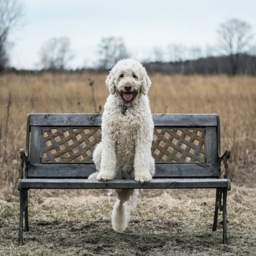
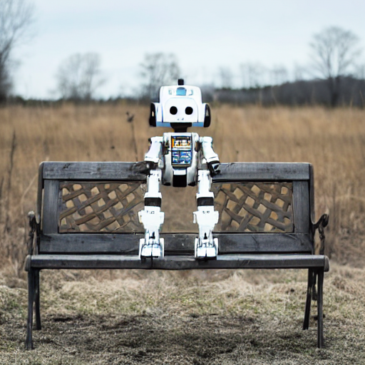
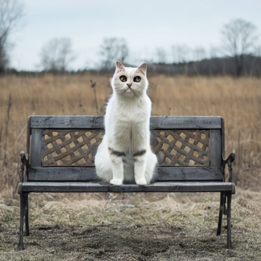

# SD_inpainting

# 核心代码
```python
# x_t -> x_t-1
latents = noise_scheduler.step(noise_pred, t, latents).prev_sample

# 将unmask区域替换原始图像的nosiy latents
init_latents_proper = noise_scheduler.add_noise(init_latents_orig, noise, torch.tensor([t]))

# mask的部分数值为0
# 因此init_latents_proper * mask为保留原始latents（不mask）
# 而latents * (1 - mask)为用生成的latents替换mask的部分
latents = (init_latents_proper * mask) + (latents * (1 - mask))
```

# Run
**原图和mask图:**
<div align=center>


</div>

```
python demo1.py
```
<div align=center>

</div>

```
python demo2.py
```
<div align=center>


</div>