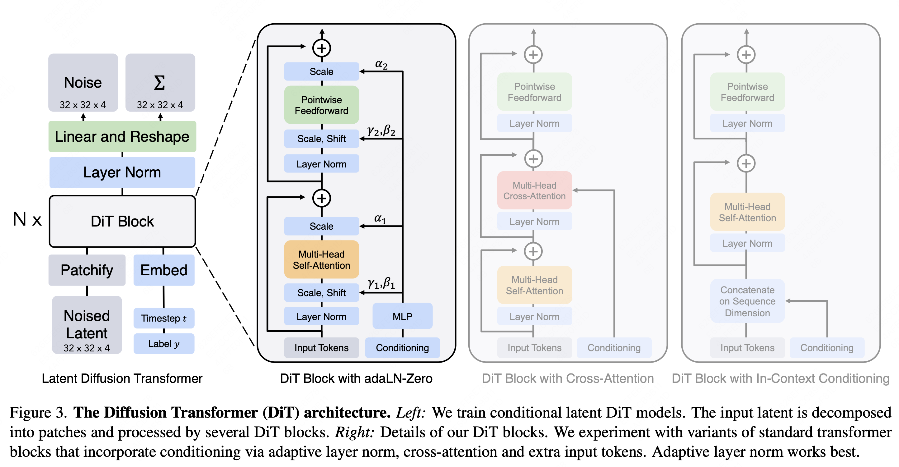
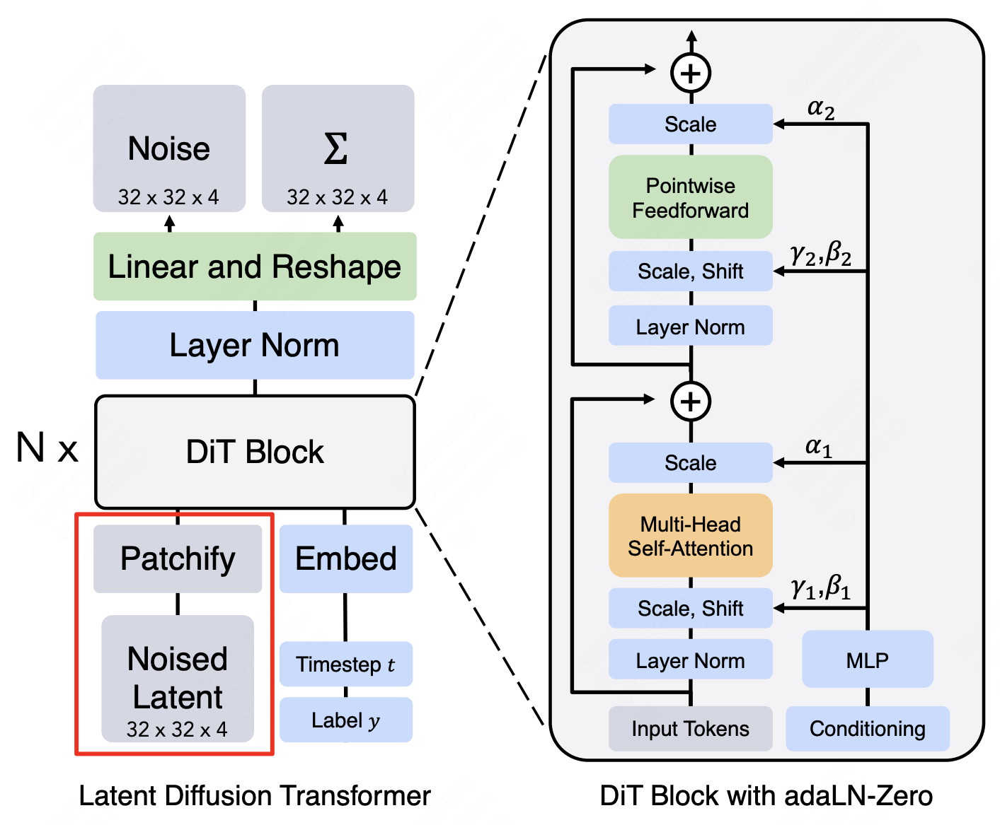
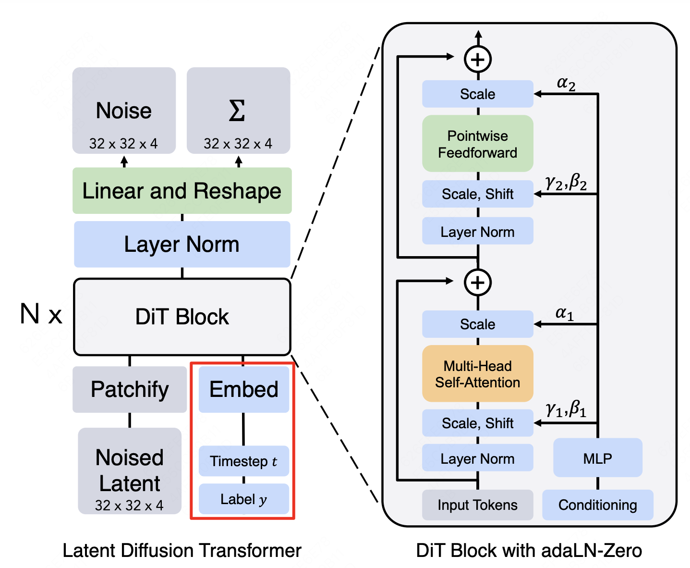
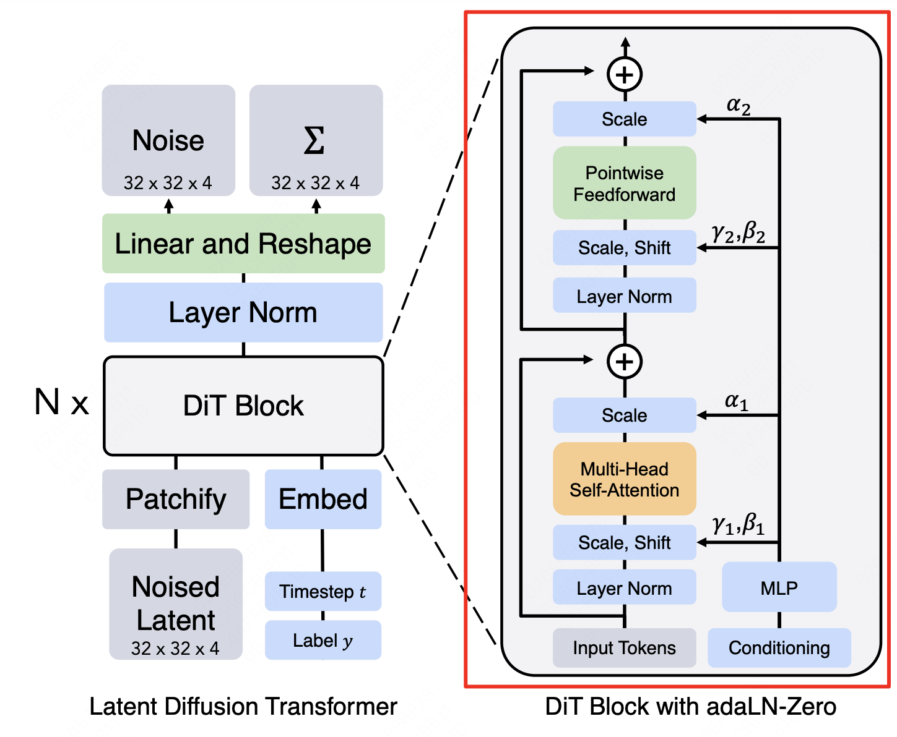
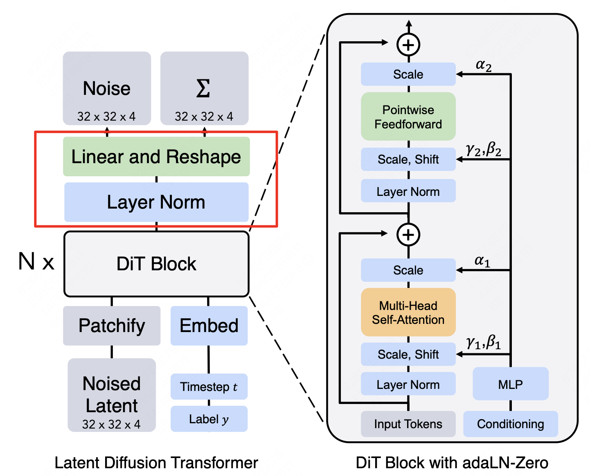

# OverView
**Origin Paper:** [Scalable Diffusion Models with Transformers](https://arxiv.org/pdf/2212.09748) <br />
**Origin Code:** [DiT](https://github.com/facebookresearch/DiT/tree/main) <br />
**FrameWork:**
<div align=center>

</div>

# 核心代码
Patch化和添加位置编码的核心代码如下：
<div align=center>

</div>

```python
# init 
self.x_embedder = PatchEmbed(input_size, patch_size, in_channels, hidden_size, bias=True)
# forward, 这里添加了位置编码
x = self.x_embedder(x) + self.pos_embed  # (N, T, D), where T = (H * W) / (patch_size ** 2)

# 使用了不可学习的位置编码，requires_grad = False
self.pos_embed = nn.Parameter(torch.zeros(1, num_patches, hidden_size), requires_grad=False)
# Initialize (and freeze) pos_embed by sin-cos embedding:
pos_embed = get_2d_sincos_pos_embed(self.pos_embed.shape[-1], int(self.x_embedder.num_patches ** 0.5))
self.pos_embed.data.copy_(torch.from_numpy(pos_embed).float().unsqueeze(0))
```

添加类别信息和timestep信息的核心代码如下：
<div align=center>

</div>

```python
# 分别将类别信息和timestep信息编码成embedding，然后相加形成最终的条件c
t = self.t_embedder(t)                   # (N, D)
y = self.y_embedder(y, self.training)    # (N, D)
c = t + y                                # (N, D)
```

DiT Block的核心代码如下：
<div align=center>

</div>

```python
class DiTBlock(nn.Module):
    """
    A DiT block with adaptive layer norm zero (adaLN-Zero) conditioning.
    """
    def __init__(self, hidden_size, num_heads, mlp_ratio=4.0, **block_kwargs):
        super().__init__()
        self.norm1 = nn.LayerNorm(hidden_size, elementwise_affine=False, eps=1e-6)
        self.attn = Attention(hidden_size, num_heads=num_heads, qkv_bias=True, **block_kwargs)
        self.norm2 = nn.LayerNorm(hidden_size, elementwise_affine=False, eps=1e-6)
        mlp_hidden_dim = int(hidden_size * mlp_ratio)
        approx_gelu = lambda: nn.GELU(approximate="tanh")
        self.mlp = Mlp(in_features=hidden_size, hidden_features=mlp_hidden_dim, act_layer=approx_gelu, drop=0)
        self.adaLN_modulation = nn.Sequential(
            nn.SiLU(),
            nn.Linear(hidden_size, 6 * hidden_size, bias=True)
        )

    def forward(self, x, c):
        shift_msa, scale_msa, gate_msa, shift_mlp, scale_mlp, gate_mlp = self.adaLN_modulation(c).chunk(6, dim=1) # 一个linear层获取6个参数
        x = x + gate_msa.unsqueeze(1) * self.attn(modulate(self.norm1(x), shift_msa, scale_msa))
        x = x + gate_mlp.unsqueeze(1) * self.mlp(modulate(self.norm2(x), shift_mlp, scale_mlp))
        return x
```

Final Layer的核心代码如下：
<div align=center>

</div>

```python
class FinalLayer(nn.Module):
    """
    The final layer of DiT.
    """
    def __init__(self, hidden_size, patch_size, out_channels):
        super().__init__()
        self.norm_final = nn.LayerNorm(hidden_size, elementwise_affine=False, eps=1e-6)
        self.linear = nn.Linear(hidden_size, patch_size * patch_size * out_channels, bias=True)
        self.adaLN_modulation = nn.Sequential(
            nn.SiLU(),
            nn.Linear(hidden_size, 2 * hidden_size, bias=True)
        )

    def forward(self, x, c):
        shift, scale = self.adaLN_modulation(c).chunk(2, dim=1)
        x = modulate(self.norm_final(x), shift, scale)
        x = self.linear(x)
        return x
```

# Debug
```python
python demo.py
```

