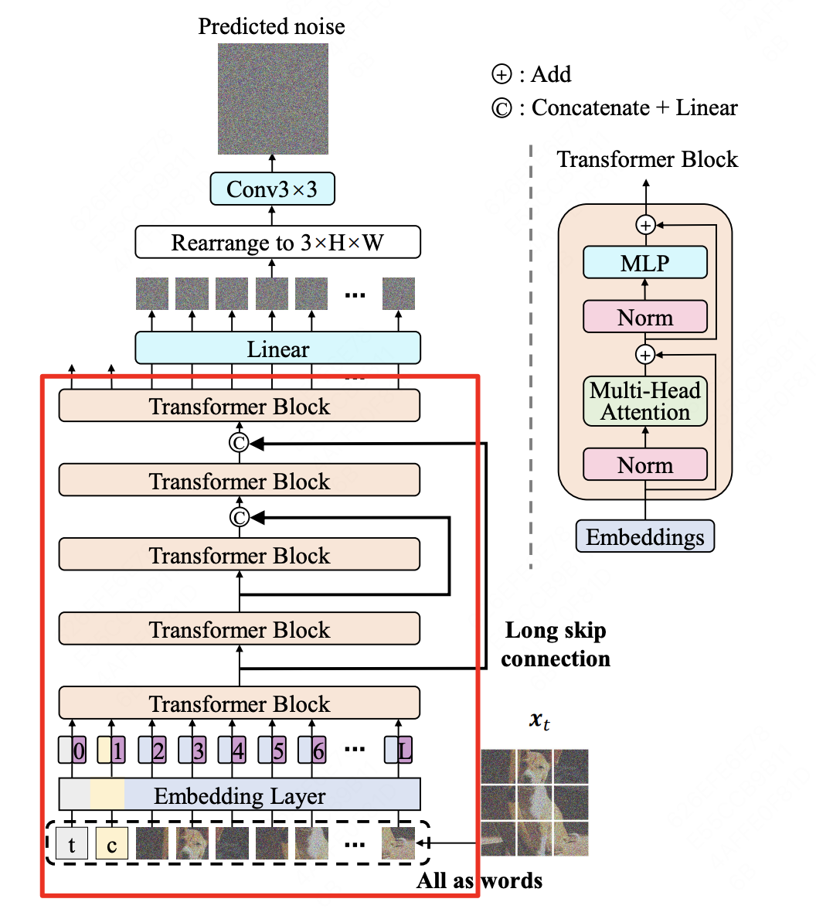

# Simple_U-ViT
# 前言
U-ViT的原论文：[All are Worth Words: A ViT Backbone for Diffusion Models](https://arxiv.org/pdf/2209.12152)

<div align=center>

</div>

# Run
1. **Video_Demo1.py** 展示了以视频格式作为输入时，U-ViT的简单实现(Demo主要实现了红色框的代码):
 ```python
 python Video_Demo1.py
 ```
2. **Image_Demo1.py** 展示了以图片格式作为输入时，U-ViT的官方实现(建议结合原论文的介绍进行debug):
 ```python
 python Image_Demo1.py
 ```
