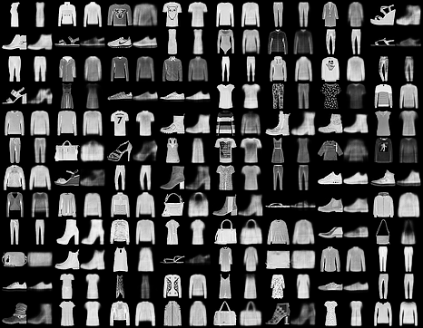

# VAE-Demo
```
python Demo_1.py # VAE_1.py
python Demo_2.py # CVAE_1.py
```

# 推荐阅读
[变分自编码器（VAE）](https://zhuanlan.zhihu.com/p/348498294)

# 简单介绍（以Demo_1.py和VAE_1.py为例）
1. VAE模块：编码器，重参数化，解码器。
```python
class VAE(nn.Module):
    def __init__(self, input_dim = 784, h_dim = 400, z_dim = 20):
        super(VAE, self).__init__()
        self.fc1 = nn.Linear(input_dim, h_dim) # 28*28 → 784 Mnist数据大小
        self.fc21 = nn.Linear(h_dim, z_dim) # 计算均值
        self.fc22 = nn.Linear(h_dim, z_dim) # 计算方差对数
        self.fc3 = nn.Linear(z_dim, h_dim)
        self.fc4 = nn.Linear(h_dim, input_dim) # 784 → 28*28
        self.input_dim = input_dim

    # 编码器
    def encode(self, x):
        h1 = F.relu(self.fc1(x))
        return self.fc21(h1), self.fc22(h1) # 计算均值、方差的对数

    # 重参数化
    def reparameterize(self, mu, logvar): 
        std = torch.exp(0.5*logvar)
        eps = torch.randn_like(std)
        # z = mu + eps*std
        return mu + eps*std

    # 解码器
    def decode(self, z):
        h3 = F.relu(self.fc3(z))
        # sigmoid: 0-1 之间，后边会用到 BCE loss 计算重构 loss（reconstruction loss）
        return torch.sigmoid(self.fc4(h3))

    def forward(self, x):
        mu, logvar = self.encode(x.view(-1, self.input_dim))
        z = self.reparameterize(mu, logvar)
        return self.decode(z), mu, logvar
```

2. 加载数据集
```python
# FashionMNIST dataset
dataset = datasets.FashionMNIST(root = './data', 
                        train = True, 
                        transform = transforms.ToTensor(), 
                        download = True)
# Data loader
data_loader = torch.utils.data.DataLoader(dataset = dataset,
                                        batch_size = batch_size, 
                                        shuffle = True)
```

3. 损失函数
$$Loss = \frac{1}{n}\sum_{i}^n\frac{1}{2}(-1 + \sigma_{i}^2 + \mu_{i}^2 - log \sigma_{i}^2) + \frac{1}{n}\sum_{i}^n||x_{i} - \mu_{i}^\prime||^2$$
$x_{i}$表示Encoder的输入，$\mu_{i}^\prime$表示Decoder的输出，代码实现中一般利用Encoder直接获取$log \sigma_{i}^2$
```
利用交叉熵损失计算原始图片和生成图片之间的重构损失
利用重参数化得到的均值和方差对数计算KL散度
```

```python
# Forward pass
x = x.to(self.device).view(-1, self.image_size) # x.shape: [B, 784]
x_reconst, mu, log_var = self.model(x) # x_reconst.shape: [B, 784]
# Compute reconstruction loss and kl divergence
reconst_loss = F.binary_cross_entropy(x_reconst, x, size_average=False)
kl_div = -0.5 * torch.sum(1 + log_var - mu.pow(2) - log_var.exp())
# Backprop and optimize
loss = reconst_loss + kl_div
```

4. 重构结果
```
左侧是原始结果，右侧是重构结果
```
<div align=center>

</div>
